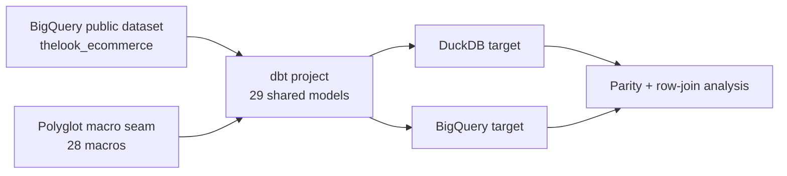
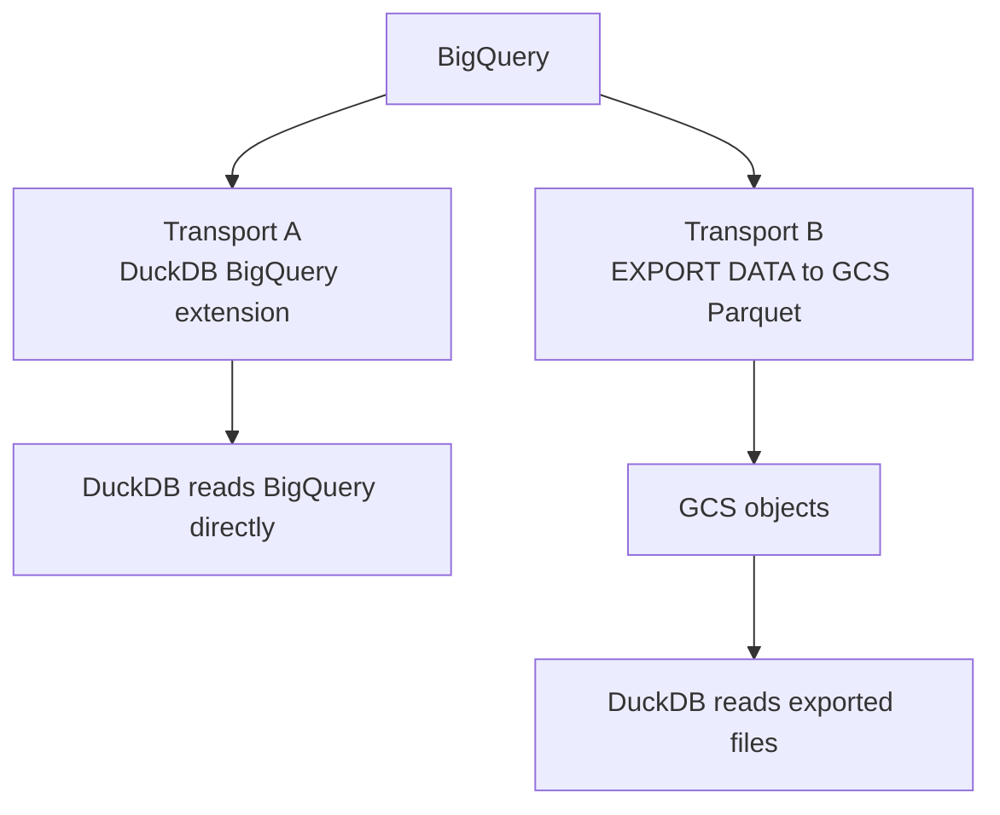

# bigquery-duckdb-dbt-experiments

A dbt v2 experiment that asks a practical architecture question:

**Can one dbt project serve both BigQuery and DuckDB without forking the model tree?**

Short answer: **yes, structurally**. The same 29 models build on both engines from one source file per model. The main gap is not SQL syntax; it is **numeric semantics**, especially how money is typed and rounded.

## Executive summary

This repository proves that a single dbt project can target:

- **BigQuery** as the cloud warehouse
- **DuckDB** as the local analytical engine
- **One shared model tree** with dialect differences isolated in a small macro seam

What matters to an architect:

- The portability pattern is real: **29 models** build on both targets with **no forked copies** and **no `target.type` branching in models**.
- The biggest divergence is also the most important one: **money precision**. BigQuery keeps sub-cent precision in `NUMERIC`; DuckDB rounds the same source values into `DECIMAL(18,2)`.
- On the same real dataset, **row counts match on all 29 models**. Exact value parity holds for **8 of 29** models and **1 of 11 marts**.
- A row-by-row follow-up on the **money-column mismatches** shows **0 genuinely different money values**. Those differences are attributable to declared scale and rounding behavior, not unexplained logic drift.
- The project also measures two ways to get BigQuery data into DuckDB:
  - **Transport A** = direct read via DuckDB's community BigQuery extension
  - **Transport B** = `EXPORT DATA` to GCS as Parquet, then read the files

## Why this repo exists

Most teams that want both a warehouse and a local engine eventually face one of two choices:

1. **Fork the transformation logic** and maintain separate BigQuery and DuckDB implementations.
2. **Keep one logical project** and absorb dialect differences in a compatibility layer.

This repo explores the second option and measures where it works, where it bends, and where it stops.

## The architecture at a glance



### What the shared project contains

- **7 staging models**
- **11 intermediate models**
- **11 mart models**
- **28 polyglot macros** in `macros/polyglot/`
- **Guardrails and harnesses** for portability, parity, and transport measurement

## Goals and outcomes

| Goal | Outcome | Why it matters |
|---|---|---|
| Run one dbt project on both BigQuery and DuckDB | **Achieved** | 29 models build on both engines from one file per model |
| Avoid engine-specific branching in models | **Achieved** | Portability guardrail reports 0 target-branch findings |
| Keep dialect differences contained | **Achieved** | Differences are concentrated in 28 macros rather than duplicated models |
| Verify structural parity | **Achieved** | Row counts match on all 29 models on the same real input rows |
| Verify exact value parity | **Partially achieved** | 8/29 models match exactly; remaining differences are overwhelmingly money precision effects |
| Explain the remaining mismatch | **Achieved** | Row-level analysis isolates declared-scale and rounding behavior as the cause |
| Characterize BigQuery→DuckDB data movement | **Achieved** | Both direct-read and file-based transports were measured end to end |

## What was actually proven

### 1) The portability seam is small enough to be practical

The project uses a macro seam instead of a forked model tree. The seam handles things like:

- type names and casts
- safe division
- date/time behavior
- array/struct rendering
- key generation

That is the important architectural result: **the project divergence lives in the seam, not in the business models**.

### 2) The real problem is semantics, not syntax

On real shared input data:

- **29/29 models** match on row count
- **8/29 models** match on every measured check
- **21 models** differ only in **55 columns**, almost entirely money-related

The main root cause is simple:

- **BigQuery** money path: `NUMERIC` with 9 decimal places
- **DuckDB** money path: `DECIMAL(18,2)` rounded to cents

If you are deciding whether one project can span both engines, this is the core takeaway: **SQL portability is manageable; numeric policy is the real design decision**.

### 3) BigQuery is slower in this shape

On the recorded value-parity run:

- **DuckDB model time:** 19.96 s
- **BigQuery model time:** 230.25 s
- **BigQuery / DuckDB:** **11.5x slower** overall

That does not make BigQuery wrong; it does mean the local development and validation loop is materially faster on DuckDB.

## Transport A vs Transport B, in plain English

This repo measures two ways to put BigQuery-backed data in front of DuckDB.



### Transport A: direct read through the DuckDB BigQuery extension

**Plain English:** DuckDB connects to BigQuery and reads tables directly.

Why it matters:

- It is the cleanest way to compare engine behavior because there is **no intermediate file format**.
- It keeps the DuckDB leg close to the real source definition.
- It is the right path when you want to study **query behavior, pushdown, type fidelity, and real parity**.

What the measurements say:

- Filter pushdown works.
- Projection pushdown works.
- Dry-run bytes predict billed bytes exactly.
- Aggregate pushdown exists but is optional.
- Type fidelity is mostly good, but timestamp and `BIGNUMERIC` edges matter.
- The community extension is the working build path; the core repo install path 404s in this setup.

**Architectural reading:** Transport A is the better choice when your question is, “Can DuckDB behave like a near-direct analytical twin of BigQuery?”

### Transport B: export files from BigQuery and read them back

**Plain English:** BigQuery writes Parquet files to Cloud Storage; DuckDB reads the files.

Why it matters:

- It decouples the consumer from BigQuery at read time.
- It creates a reusable artifact that can be read by more than DuckDB.
- It is closer to a batch interchange or distribution pattern than a live compatibility path.

What the measurements say:

- It works well for Parquet-based interchange.
- Row order is **not reproducible** without `ORDER BY`.
- CSV cannot carry nested/repeated structures.
- `JSON` to Parquet is refused.
- `BIGNUMERIC` silently narrows in the file path.
- Reverse movement (DuckDB writes Parquet, BigQuery loads it) is viable, but shape details matter.

**Architectural reading:** Transport B is the better choice when your question is, “How do I publish or exchange data artifacts across systems?” not “How do I compare engine semantics directly?”

### When to use which

| Need | Better fit |
|---|---|
| Validate one logical dbt project across both engines | **Transport A** |
| Compare values on the same input rows | **Transport A** |
| Publish reusable files for downstream tools | **Transport B** |
| Decouple readers from BigQuery at query time | **Transport B** |
| Preserve the cleanest causal chain for parity debugging | **Transport A** |

## The key findings an architect should care about

### What this proves

- A **single dbt codebase** for BigQuery and DuckDB is feasible.
- The seam can stay **small and explicit**.
- Most drift risk is **not** from syntax branching; it is from **data type behavior**.
- A local DuckDB target is highly useful as a **fast development and investigation loop**.

### What this does not prove

- That all warehouse features map cleanly between engines.
- That BigQuery-specific physical design features should be hidden behind the seam.
- That file exports preserve every BigQuery type without compromise.
- That money precision policy can be ignored.

## Recommended interpretation

If you are a senior architect deciding whether this pattern is worth using:

- **Use one shared project** if your value is development speed, logical consistency, and keeping transformation logic in one place.
- **Treat numeric policy as a first-class architecture choice**, especially for money.
- **Use DuckDB as the fast local execution environment**, not as a promise of byte-for-byte equivalence under all type choices.
- **Prefer Transport A for parity and investigation**, and Transport B for artifact distribution and cross-system interchange.

## Repository map

| Path | Purpose |
|---|---|
| `Makefile` | Entry point for setup, build, parity, and transport measurement commands |
| `models/` | Shared dbt model tree |
| `macros/polyglot/` | Cross-engine compatibility seam |
| `scripts/parity.py` | Cross-target parity harness |
| `scripts/row_join.py` | Row-level follow-up on money differences |
| `scripts/check_portability.py` | Guardrail against engine-specific leakage |
| `analyses/transport_a/` | Direct-read transport evidence |
| `analyses/transport_b/` | File-based transport evidence |
| `analyses/value_parity/` | Same-data parity results |
| [`docs/challenges.md`](docs/challenges.md) | Full list of issues encountered and resolved |
| [`docs/gaps.md`](docs/gaps.md) | What remains unverified or intentionally unresolved |
| [`docs/move_to_duckdb.md`](docs/move_to_duckdb.md) | What it takes to turn this into a DuckDB-only project |

## Quickstart

### Setup

```bash
make setup
make check-env
```

### Common commands

The commands below are defined in `Makefile`. The transport commands write their evidence under `analyses/transport_a/` and `analyses/transport_b/`.

```bash
make duck           # build the DuckDB target against the local fixture
make bq             # build the BigQuery target (credentials required)
make parity         # structural parity checks across both targets
make value-parity   # same-data value comparison across both targets
make transport-a    # measure the direct-read path
make transport-b    # measure the file-based path
make portability    # fail if one target leaks the other target's dialect
make move-to-duckdb # generate a DuckDB-only version of the project
```

### What the main targets do

- `make duck` builds the shared project locally on DuckDB.
- `make bq` builds the shared project on BigQuery.
- `make value-parity` is the most important verification run: it loads the same real source rows into DuckDB, builds both targets, and compares outputs.
- `make transport-a` and `make transport-b` run the engine-specific transport measurement suites in `analyses/`; they are evidence runs, not part of the shared portable model tree.

## Where to go deeper

If you want the evidence rather than the summary:

- Start with [`analyses/value_parity/results.md`](analyses/value_parity/results.md)
- Then read [`analyses/transport_a/README.md`](analyses/transport_a/README.md)
- Then [`analyses/transport_b/README.md`](analyses/transport_b/README.md)
- Use [`docs/challenges.md`](docs/challenges.md) for the blow-by-blow history
- Use [`docs/gaps.md`](docs/gaps.md) for the unresolved edges

## Bottom line

This repository matters because it turns an architectural hunch into evidence.

The evidence says:

- **one shared dbt project is viable**,
- **DuckDB is an excellent local counterpart to BigQuery**,
- and **the hard part is not SQL transpilation but precision policy**.

If you are deciding whether to centralize model logic while supporting both warehouse and local execution, this repo is a concrete, measured example of where that strategy works and what trade-offs it forces into the open.
